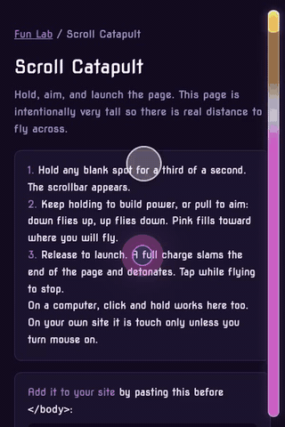

# Fun Lab

Free, open source UX and UI experiments by [Cerebral Authority](https://cerebralauthority.com). Try each one live at **[fun-lab.cerebralauthority.com](https://fun-lab.cerebralauthority.com)**, then add it to your own site with one line.

## Experiments

### [Scroll Catapult](packages/scroll-catapult)

<a href="https://fun-lab.cerebralauthority.com/scroll-catapult/"></a>

Hold, aim, and launch the page on mobile. A full charge slams the end of the page and detonates.
[Try it](https://fun-lab.cerebralauthority.com/scroll-catapult/) · [Docs](packages/scroll-catapult) · `npm i @cerebralauthority/scroll-catapult`

Each experiment is its own npm package, so you only download the ones you use. Setup instructions and options are in each package's README.

## License

MIT. Use them in personal and commercial projects; keep the copyright notice.

---

## Maintainer guide

### How the repo is organized

```
fun-lab/
├── packages/                       one folder per experiment
│   └── scroll-catapult/
│       ├── scroll-catapult.js      the library itself (what people install)
│       ├── scroll-catapult.d.ts    TypeScript types
│       ├── package.json            its npm name, version, and which files npm ships
│       ├── README.md               its docs, shown on GitHub and npm
│       ├── CHANGELOG.md            what changed in each version, and how it was verified
│       ├── LICENSE
│       ├── preview.scenario.mjs    the gesture the preview recorder performs
│       ├── test/behavior.html      browser behavior tests
│       └── demo/                   its live demo page (website only, never on npm)
│           ├── index.html
│           ├── preview.mp4         looping clip for the lab home card
│           ├── preview.jpg         still frame for reduced motion visitors
│           └── preview.gif         the same clip for READMEs
├── site/
│   └── index.html                  the lab home page (the gallery of cards)
├── scripts/
│   ├── build-site.mjs              assembles the website from the folders above
│   ├── test.mjs                    runs an experiment's behavior tests in headless Chrome
│   ├── record-preview.mjs          records an experiment's preview video, still, and GIF
│   └── release-check.mjs           verifies a published npm release and prints its snippet
├── .claude/skills/launch-experiment/   step by step launch playbook for Claude Code
└── .github/workflows/pages.yml     deploys the website on every push to main
```

### Where each file ends up

The same folders feed two destinations.

| Destination | What goes there | How |
| --- | --- | --- |
| **The website** (fun-lab.cerebralauthority.com) | `site/index.html` becomes `/`. Each `packages/<name>/demo/` becomes `/<name>/`, with the library file copied next to it. | Automatic on every push to `main` |
| **npm** (what developers install) | Only the files listed under `"files"` in that package's `package.json`, plus its README, CHANGELOG, and LICENSE. The `demo/` and `test/` folders and the scenario file are never shipped. | Manual: `npm publish` from the package folder |

So a new folder at `packages/buzzer/` with a `demo/` inside automatically becomes `fun-lab.cerebralauthority.com/buzzer/`. The build script finds every package folder that has a `demo/`; nothing needs registering.

### Launch a new experiment

In Claude Code, ask to "launch a new Fun Lab experiment" and the `launch-experiment` skill walks the whole path. By hand:

1. **Copy the folder.** Duplicate `packages/scroll-catapult` as `packages/<new-name>`. Lowercase with hyphens; the folder name becomes the URL path.
2. **Replace the library.** Rename and rewrite `<new-name>.js` and `<new-name>.d.ts`.
3. **Update `package.json`.** `name`, `description`, `version` (`0.1.0`), `homepage`, `repository.directory`, `files`, `main`, `types`, `unpkg`, `jsdelivr`.
4. **Rewrite `README.md` and `CHANGELOG.md`.**
5. **Build the demo** in `demo/index.html`. It loads the library as `./<new-name>.js`.
6. **Write the tests** in `test/behavior.html`, then `npm test -- <new-name>`.
7. **Record the preview.** Write `preview.scenario.mjs` for the new gesture, then `npm run record -- <new-name>`.
8. **Add it to the gallery.** A card in `site/index.html` (preview video, GitHub and npm icons) and a section with the GIF in this README.
9. **Preview locally** with `npm run preview`, and on a phone.
10. **Push to `main`.** The site updates in about a minute.
11. **Release to npm** (below), then update the install snippets and tag the release.

### Change an existing experiment

- **Demo page, preview, or home card only:** edit and push. The website updates; npm is unaffected.
- **The library itself:** edit, push, then release a new version. Sites pinned to the old version keep it until they choose to upgrade.

### Release a version to npm

Run these in the Mac Terminal app (not with a `!` prefix; in Terminal, `!` means "not" and silently skips the command after `&&`).

1. **Test, then bump.** Run `npm test -- <name>`. Bump `version` in the package's `package.json` and add a `CHANGELOG.md` entry.
   - `0.1.0` to `0.1.1`: bug fix
   - `0.1.0` to `0.2.0`: new option or behavior (below 1.0, treat as possibly breaking)
   - after `1.0.0`: any breaking change bumps the first number
2. **Publish:**
   ```bash
   cd ~/Desktop/fun-lab/packages/<name>
   npm publish
   ```
   npm prints an `Authenticate your account at:` link. Press Enter, approve in the browser with the authenticator code, and wait for `+ @cerebralauthority/<name>@<version>` in Terminal.
3. **Verify and get the snippet:**
   ```bash
   cd ~/Desktop/fun-lab
   npm run release-check -- <name>
   ```
   It confirms the published file matches the repo and prints the pinned `<script>` snippet with its integrity hash. Paste that snippet into the package README and `demo/index.html`, rerun until every line says `ok`, then push.
4. **Tag the release** with the command `release-check` prints, so the published code maps to a commit.

Notes: the public npm page can take a minute to show a new package even after `+` appears. A version number can never be reused, and unpublishing is only allowed within 72 hours, so fixes always go out as a new version.

### Preview locally

```bash
npm run preview
```

Open http://localhost:8080. To test on a phone on the same Wi-Fi, open `http://<this computer's IP>:8080`.

### Hosting and accounts

| What | Where |
| --- | --- |
| Website | GitHub Pages from `.github/workflows/pages.yml`, custom domain `fun-lab.cerebralauthority.com` |
| DNS | GoDaddy: `CNAME fun-lab -> cerebral-authority.github.io`, plus the GitHub domain verification TXT record |
| Code | github.com/Cerebral-Authority/fun-lab (public) |
| Packages | npm organization `cerebralauthority`, owned by npm user `cerebral-authority`, 2FA on |
| CDN | jsDelivr serves every npm version automatically; nothing to configure |

The domain is verified on the Cerebral-Authority GitHub account, so no other account can serve Pages on it.
